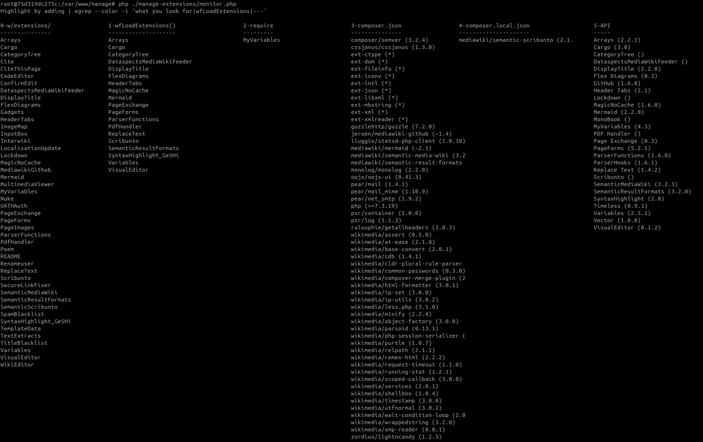

# dataspects mediawiki-cli

* dataspects mediawiki-cli is is a tool set for managing MediaWiki instances on [dataspects Snoopy](https://github.com/dataspects/snoopy).
* `mediawiki-cli` is exclusively used through [`dataspects/mediawiki`](https://hub.docker.com/r/dataspects/mediawiki) container images ([docker build](https://github.com/dataspects/dataspectsSystemBuilder/tree/master/docker-images/mediawiki)).
* *For a development setup, see `mediawiki-cli production/development volume` in `templates/docker-compose.yml`.*

## Concepts

| Aspect |   |
| ------ | - |
| `docker-compose.yml` | See `templates/docker-compose.yml` for<ul><li>**environment variables**</li><li>**persistent volumes/mounts**</li></ul> |
| `/var/www/config/` | <ol><li>The container's `/var/www/html/w/LocalSettings.php` is immutable/ephemeral.</li><li>All **CLI-managed** `LocalSettings.php` customizations are added to `/var/www/config/mwmconfigdb.sqlite` on a per-line basis. `/var/www/config/mwmconfigdb.sqlite` is then compiled into `/var/www/config/mwmLocalSettings.php` which is [required by `/var/www/html/w/LocalSettings.php` at the end <u>**but before**</u> mwmLocalSettings_manual.php](https://github.com/dataspects/dataspectsSystemBuilder/blob/master/docker-images/mediawiki/require_customizations.sh). &rarr; *This covers settings that **enable** features/extensions/functionality.*</li><li>All **manual** `LocalSettings.php` customizations are managed in `/var/www/config/mwmLocalSettings_manual.php` which is [required by `/var/www/html/w/LocalSettings.php` <u>**at the very end**</u>](https://github.com/dataspects/dataspectsSystemBuilder/blob/master/docker-images/mediawiki/require_customizations.sh). &rarr; *This covers settings that **configure** features/extensions/functionality.*</li><ol> |

## Features

| In `docker exec -it --workdir /var/www/manage/ <WIKI_CONTAINER_NAME> /bin/bash` run... | Purpose |
| ---------------------------------------------- | ------- |
| `./status.sh` | Status report |
| `php ./manage-config/view-mwm-config.php` | Check LocalSettings.php customizations (see Concepts) |
| `./manage-extensions/show-extension-catalogue.sh` | View [MWStake-certified extensions](https://raw.githubusercontent.com/dataspects/mediawiki-cli/main/catalogues/extensions.json) |
| `./manage-extensions/enable-extension.sh <EXTENSION_NAME>` | **!** Enable [MWStake-certified extensions](https://raw.githubusercontent.com/dataspects/mediawiki-cli/main/catalogues/extensions.json) |
| `./manage-extensions/disable-extension.sh  <EXTENSION_NAME>` | **!** Disable [MWStake-certified extensions](https://raw.githubusercontent.com/dataspects/mediawiki-cli/main/catalogues/extensions.json) |
| `./manage-content/inject-ontology-WikiPageContents.sh` | **!** Inject content from a repository ([example](https://github.com/dataspects/dataspectsSystemCoreOntology)) |
| `php manage-extensions/monitor.php` | View extensions installation aspects |
| `./manage-content/inject-local-wikitext.sh` | **!** Inject content from [WikiPageContents](https://github.com/dataspects/mediawiki-cli/tree/main/WikiPageContents) |
| `./manage-content/inject-manage-page-from-mediawiki.org.sh` | **!** Copy content from wiki A into a wiki B (e.g. from mediawiki.org) |
| `./manage-snapshots/view-restic-snapshots.sh` |  [View snapshots](https://restic.readthedocs.io/en/stable/045_working_with_repos.html) |
| `./manage-snapshots/take-restic-snapshot.sh` |  [Take snapshot](https://restic.readthedocs.io/en/stable/040_backup.html) |
| `./manage-snapshots/restore-restic-snapshot.sh` |  [Restore snapshot](https://restic.readthedocs.io/en/stable/050_restore.html) |
| `./manage-snapshots/diff-restic-snapshots.sh` |  [Compare snapshots](https://restic.readthedocs.io/en/stable/040_backup.html?highlight=diff#comparing-snapshots) |

## Component Logics

<figure>

    <figcaption>dataspects/mediawiki-cli's <a href="https://github.com/dataspects/mediawiki-cli/blob/main/manage-snapshots/view-restic-snapshots.sh">view-restic-snapshots</a></figcaption>
</figure>

## Snapshots

<figure>

    <figcaption>dataspects/mediawiki-cli's <a href="https://github.com/dataspects/mediawiki-cli/blob/main/manage-snapshots/view-restic-snapshots.sh">view-restic-snapshots</a></figcaption>
</figure>

## Extensions Monitor

<figure>

    <figcaption>dataspects/mediawiki-cli's extensions monitor</figcaption>
</figure>

## Upgrading

When Docker initializes volumes, the corresponding contents from inside the container end up in the persistent volumes.

FIXME: **When upgrading by running a new container, the `skins/`, `vendor/` and `extensions/` folders must be consolidated.**:

Let's say we upgrade from 1.35 to 1.36 and we had composer.local.json managing some content in `vendor/`:

1. Merge the new 1.36 `skins/`, `vendor/` and `extensions/` content into the corresponding volumes, overwriting existing content and adding new content? (This would add new skins/extensions coming with MediaWiki 1.36 and/or [being added by dataspects](https://github.com/dataspects/dataspectsSystemBuilder/tree/master/ansible_templates).)
2. Run a composer install or update?

HACK:
`rm -r temp/* && docker cp $(docker create --rm dataspects/mediawiki:1.36.2-3.2.3_211026-aarch64):/var/www/html/w/<vendor|skins|extensions>/. temp/ && docker cp temp/. smwcindykate:/var/www/html/w/<vendor|skins|extensions>/`

## Install a MediaWiki instance using mediawiki-cli

1. Create a folder `mymediawiki/`
2. Copy `templates/docker-compose.yml` into `mymediawiki/`
3. Fill in all `...` in `mymediawiki/docker-compose.yml`
4. Create `mymediawiki/composer.local.json` and `mymediawiki/composer.local.lock` each with content `{}`
5. Run `docker-compose up`
6. Enter mymediawiki's process namespace by running `docker exec -it --workdir /var/www/manage mymediawiki /bin/bash`
7. At `/var/www/manage/install#` run `initialize-database.sh` and `import-database.sh`
8. At `/var/www/html/w#` run `php maintenance/update.php --quick`
---
9. At `/var/www/manage/#` run `status.sh`
---
10. At `/var/www/manage/#` run `./manage-config/initialize-mwcliconfigdb.sh`
11. At `/var/www/manage/#` run `php manage-config/addLineToMWMSQLite.php "config" "\$wgServer = 'http://mymediawiki:8080';"`
12. At `/var/www/manage/#` run `php manage-config/compileMWMLocalSettings.php`
---
13. At `/var/www/manage/#` run `status.sh`
---
14. At `/var/www/config` create the file `mwmLocalSettings_manual.php` with content `<?php`
